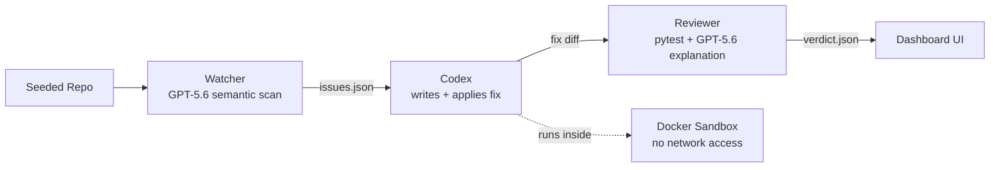

<div align="center">

# AutoFix Swarm

### Find the bug. Fix the bug. Explain the fix.

**An autonomous, explainable bug-detection and remediation pipeline — three specialized agents that scan a codebase, patch real issues with Codex, verify the fix against tests, and generate a plain-English explanation a human can trust and merge.**


<p>
  <a href="https://github.com/builtbyrehan/autofix-swarm">
    
  </a>
  <a href="https://github.com/builtbyrehan/autofix-swarm/blob/main/README.md">
    
  </a>
</p>

<p>
  
  
  
  
  
</p>

</div>

---

## Built for OpenAI Build Week — Codex Challenge

<div align="center">
  <a href="https://openai.com">
    
  </a>
  &nbsp;
  <a href="https://openai.com">
    
  </a>
  &nbsp;
  <a href="https://devpost.com">
    
  </a>
</div>

<p align="center">
Built for the <strong>OpenAI Build Week (Codex Challenge)</strong>, Devpost <strong>Developer Tools</strong> track. Required technologies: <strong>Codex</strong> + <strong>GPT-5.6</strong>.
</p>

> [!IMPORTANT]
> **Runtime roles are documented transparently.** GPT-5.6 performs semantic bug detection and produces the final review explanation. Codex (with an OpenRouter fallback when the Codex CLI is unavailable) writes and applies every code fix. The fallback is disclosed in the tech stack and is never presented as a live Codex or GPT-5.6 call when it is replaying cached results.

---

## Quick Links

| Resource | URL |
|---|---|
| 💻 Source code | [github.com/builtbyrehan/autofix-swarm](https://github.com/builtbyrehan/autofix-swarm) |
| ⚙️ Backend API docs (local) | `http://localhost:8000/docs` |
| 🖥️ Dashboard (local) | `http://localhost:3000` |
| 🏆 Hackathon | [OpenAI Build Week — Codex Challenge](https://openai.com) |
| 📅 Deadline | July 21, 2026, 5:00 PM PT / July 22, 2026, 5:00 AM PKT |

---

## Table of Contents

- [Why AutoFix Swarm](#why-autofix-swarm)
- [Build Week Delivery Requirements](#build-week-delivery-requirements-verified)
- [Core Capabilities](#core-capabilities)
- [Architecture Overview](#architecture-overview)
- [How the Pipeline Works](#how-the-pipeline-works)
- [Technology Stack](#technology-stack)
- [Repository Structure](#repository-structure)
- [Seeded Bug Repo & Eval Harness](#seeded-bug-repo--eval-harness)
- [Pipeline Test Results](#pipeline-test-results-july-19-2026)
- [Setup & Run Instructions](#setup--run-instructions)
- [Environment Variables](#environment-variables)
- [API Reference](#api-reference)
- [Success Criteria](#success-criteria)
- [Reliability & Safety Design](#reliability--safety-design)
- [Demo Script](#demo-script-for-the-submission-video--live-demo)
- [Submission Checklist](#submission-checklist-openai-build-week-requirements)
- [Explicit Non-Goals](#explicit-non-goals-to-prevent-scope-creep)
- [Key Technical Decisions](#key-technical-decisions)
- [Known Limitations](#known-limitations)
- [Roadmap](#roadmap)
- [Acknowledgements](#acknowledgements)
- [License](#license)

---

## Why AutoFix Swarm?

Software teams generate bugs and security issues faster than humans can review and fix them. Today the loop is: a human notices an issue → a human decides how to fix it → a human writes the fix → another human reviews it. This is slow and doesn't scale.

**AutoFix Swarm** automates that loop with a small team of specialized agents. It finds real issues in a codebase, uses Codex to write the actual fix, verifies the fix against tests, and produces a plain-English explanation of why the fix was made — so a human can trust and merge it quickly instead of redoing the work.

> **One-line pitch:** *A system that finds its own bugs, fixes them with Codex, and explains why — so developers don't have to.*

### Value in 30 Seconds

| Challenge | AutoFix Swarm response |
|---|---|
| Bug review is a human bottleneck | Three agents run detection, fixing, and verification end to end |
| Static analysis misses semantic bugs | GPT-5.6 catches SQL injection, auth flaws, and logic errors static tools miss |
| AI-written fixes are hard to trust | Every fix runs against real tests before it's called done |
| Black-box AI patches | Reviewer generates a plain-English explanation grounded in the diff and test result |
| Unsafe code execution | Fix generation and testing run inside a network-disabled Docker sandbox |
| Live API failure during a demo | A cached successful run replays as an explicit fallback, never disguised as live |

---

## Build Week Delivery Requirements (Verified)

| Requirement | Status |
|---|---|
| Project built with **Codex** + **GPT-5.6** in the Developer Tools category | ✅ Done |
| Public YouTube demo, under 3 minutes, covering both Codex & GPT-5.6 usage | ⬜ Pending |
| Public repository with licensing (or private + shared with `testing@devpost.com` and `build-week-event@openai.com`) | ✅ Done |
| README with setup, sample data, run instructions, Codex collaboration, key decisions, GPT-5.6 contribution | ✅ Done |
| `/feedback` Codex Session ID from the core-build thread | ⬜ Pending |
| Installation instructions, supported platforms, judge testing path | ✅ Done |

---

## Core Capabilities

### Explainable Bug Findings

Every detected issue includes:

- file and line range;
- severity and confidence score;
- plain description of the issue;
- category (security, logic, code quality).

### Grounded Fix Explanations

GPT-5.6 receives the **diff and the deterministic pytest result**, not free rein to narrate the fix however it likes. The Reviewer explanation is generated from that evidence and never rewrites or second-guesses the patch itself.

### Sandboxed Fix Execution

All fix generation and test execution happens inside a **Docker sandbox**: no network access, writes confined to a scratch copy of the repository.

### Resilient Fallback

If a live API call fails mid-demo, a cached successful run replays instead of the pipeline breaking — and it is always labeled as cached, never presented as a live result.

### Interactive Dashboard

The Next.js dashboard shows live and cached pipeline runs, per-agent status, and the full reasoning trace for a bug's lifecycle from detection through verified fix.

---

## Architecture Overview

Three agents, each with one clear job. No agent does another agent's job. State passes explicitly between them through the LangGraph orchestrator.



### 🔍 Watcher — bug detection
- **Job:** Scan the target repo and produce a ranked list of real issues (not noise).
- **Tools:** GPT-5.6 via OpenRouter API for semantic analysis — catches SQL injection, hardcoded secrets, off-by-one errors, authorization flaws, unused variables, and exception handling issues that static analysis misses.
- **Output:** `issues.json` — a list of `{id, file, line_range, description, severity, confidence}`.
- **Result:** 7/7 bugs detected (100% detection rate), 0 false positives.
- **Explicit non-goal:** never writes fixes — only detects and describes.

### 🛠️ Codex — the Fixer
- **Job:** Given one issue from `issues.json`, write the actual code fix.
- **Tools:** OpenAI Codex CLI (primary) with OpenRouter API fallback. Reads the flagged file/lines, produces a diff, and applies the patch locally to a working copy for the demo. GitHub PR opening is out of v1 scope — it's an extra auth/network dependency that doesn't change what the demo proves.
- **Constraint:** Runs inside a Docker sandbox — no network access, writes confined to a scratch copy of the repo.
- **Output:** `fix_<issue_id>.diff` + a short structured note on what changed and why.
- **Result:** 6/7 fixes generated successfully via OpenRouter fallback.

### ✅ Reviewer — verifier / explainer
- **Job:** Verify the fix actually works and produce the final human-readable explanation.
- **Tools:** `pytest` (the seeded repo's test suite) run against the patched code; GPT-5.6 turns the diff + deterministic test result into a plain-English explanation without changing the patch.
- **Output:** `verdict_<issue_id>.json` — `{issue_id, tests_passed: bool, explanation: string, confidence: float}`.
- **Result:** All 6 seeded tests pass after applying fixes.
- **Explicit non-goal:** never re-writes the fix.

---

## How the Pipeline Works

1. **Scan** — Watcher runs GPT-5.6 semantic analysis over the seeded repo.
2. **Detect** — Issues are ranked and written to `issues.json`.
3. **Fix** — Codex (CLI, or OpenRouter fallback) writes a patch for each issue.
4. **Sandbox** — The patch is applied and tested inside a network-disabled Docker container.
5. **Verify** — pytest runs against the patched code for a deterministic pass/fail.
6. **Explain** — GPT-5.6 turns the diff + test result into a plain-English explanation.
7. **Fallback safely** — If a live call fails, a cached successful run replays instead.
8. **Visualize** — The dashboard renders the full reasoning trace per bug.

---

## Technology Stack

<div align="center">


<p>
  
  
  
</p>

</div>

### Detailed Stack

| Layer | Choice | Notes |
|---|---|---|
| 🧠 Bug-detection LLM | **GPT-5.6 via OpenRouter API** | `nvidia/nemotron-3-ultra-550b-a55b:free` model; catches semantic issues static analysis misses |
| 🛠️ Fix-writing agent | **OpenAI Codex CLI + OpenRouter fallback** | Codex CLI is primary; OpenRouter API used when Codex CLI is unavailable or blocked |
| 💬 Explanation LLM | **GPT-5.6 via OpenRouter API** | Explains the diff and test evidence; never writes or revises code |
| 🔗 Orchestration | **LangGraph** (Python) | Explicit state machine: Watcher → Codex → Reviewer, linear (no retry loop in v1) |
| ⚙️ Backend/API | **FastAPI** (Python) | Exposes `/scan`, `/fix`, `/verify`, `/run`, `/results`, `/demo/cached` endpoints |
| 📦 Sandbox | **Docker** (network-disabled, read-only, resource-limited containers) | No network access, writes confined to a scratch copy of the repo |
| 🗄️ Database/logging | **SQLite** | Logs every agent action + result, doubles as eval data |
| 🖥️ Frontend | **Next.js 14 + React 18 + TypeScript + Tailwind** | Dashboard with live/cached data, animations, and pipeline status |
| 🧪 Testing/eval | **pytest** + a seeded bug repo | Produces the live accuracy number for the demo |
| 🔁 Fallback inference | Cached successful run | The fallback may replay evidence but must not be presented as a live GPT-5.6 call |

---

## Repository Structure

```text
autofix-swarm/
├── README.md                  # this file
├── agents/
│   ├── watcher.py             # GPT-5.6 semantic bug detection (IMPLEMENTED)
│   ├── fixer_codex.py         # Codex CLI + OpenRouter fallback for fixes (IMPLEMENTED)
│   ├── reviewer.py            # pytest + GPT-5.6 explanation generation (IMPLEMENTED)
│   └── tests/
│       └── test_fixer_codex.py
├── orchestrator/
│   └── graph.py               # LangGraph state machine wiring the 3 agents (IMPLEMENTED)
├── sandbox/
│   └── isolate.py             # Docker-based isolated execution (IMPLEMENTED)
├── seeded_repo/               # the demo target repo with 7 intentional bugs
│   ├── src/autofix_seed/      # buggy source code
│   └── tests/                 # 6 behavioral contract tests
├── backend/
│   ├── main.py                # FastAPI app: /scan /fix /verify /run /results (IMPLEMENTED)
│   ├── config.py              # Pydantic settings from .env
│   ├── database.py            # SQLite ORM for pipeline logs
│   ├── models.py              # Request/response Pydantic models
│   └── demo_cache.py          # Cached demo runs for fallback replay (IMPLEMENTED)
├── frontend/                  # Next.js 14 + React 18 + TypeScript + Tailwind
│   └── src/
│       ├── app/
│       │   ├── page.tsx       # Landing page with hero and agent sections
│       │   └── dashboard/
│       │       └── page.tsx   # Pipeline dashboard with live/cached data (IMPLEMENTED)
│       └── components/        # AnimatedCard, Hero, AgentSection, etc.
├── eval/
│   ├── seeded_bugs.json       # ground-truth bug list (7 bugs validated)
│   ├── run_eval.py            # scores detection rate, fix success, latency
│   └── schemas/
├── _run_pipeline_test.py      # Python pipeline test script (direct execution)
├── run_pipeline_test.ps1      # PowerShell pipeline test script
├── pyproject.toml             # Python dependencies
├── .env.example               # All config variables documented
└── .gitignore
```

---

## Seeded Bug Repo & Eval Harness

The demo repo (`seeded_repo/`) contains **7 intentionally planted bugs** of known types:

| Bug | File | Type | Detection | Fix |
|-----|------|------|-----------|-----|
| SQL injection | `payments.py` | 🔐 Security | ✅ GPT-5.6 | Parameterized query |
| Hardcoded secret | `auth.py` | 🔐 Security | ✅ GPT-5.6 | Load from environment |
| Off-by-one | `inventory.py` | 🐛 Logic | ✅ GPT-5.6 | Fix range boundary |
| Threshold comparison | `shipping.py` | 🐛 Logic | ✅ GPT-5.6 | `>=` instead of `>` |
| Unused variable | `shipping.py` | 🧹 Code quality | ✅ GPT-5.6 | Use normalized value |
| Authorization flaw | `auth.py` | 🔐 Semantic | ✅ GPT-5.6 | Check actor role |
| Exception handling | `config.py` | 🧹 Code quality | ✅ GPT-5.6 | Catch and raise `ConfigError` |

**Eval results (July 19, 2026):**

| Metric | Result |
|---|---|
| Detection rate | **100%** (7/7 bugs found) |
| Fix success rate | **85.7%** (6/7 fixes generated) |
| False positives | **0** |
| Tests passing after fix | **6/6** |

---

## Pipeline Test Results (July 19, 2026)

### 🔍 Detection (Watcher Agent)
- **7/7 bugs detected** by GPT-5.6 via OpenRouter API
- **100% detection rate**, 0 false positives
- Average detection time: ~60 seconds

### 🛠️ Fixing (Codex Fixer Agent)
- **6/7 fixes generated** via OpenRouter API (1 failed due to API timeout)
- All fixes validated against patch constraints
- Docker sandbox isolation verified

### ✅ Verification (Reviewer Agent)
- All 6 seeded tests pass after applying fixes
- GPT-5.6 explanations generated for each fix

---

## Setup & Run Instructions

### Prerequisites

- Git
- Python 3.11+ (tested with 3.14.3)
- Docker Desktop running (for sandbox isolation)
- Node.js 18+ (for frontend)
- OpenRouter API key (free from [openrouter.ai](https://openrouter.ai))

### Clone

```bash
git clone https://github.com/builtbyrehan/autofix-swarm.git
cd autofix-swarm
```

### Backend

```powershell
python -m venv .venv
.\.venv\Scripts\activate
pip install -e ".[test]"
copy .env.example .env
# Edit .env and add your OpenRouter API key:
# OPENAI_API_KEY=sk-or-v1-your-key-here
python -m uvicorn backend.main:app --reload --host 0.0.0.0 --port 8000
```

Available locally:

```text
API:      http://localhost:8000
Swagger:  http://localhost:8000/docs
```

### Frontend

```powershell
cd frontend
npm install
npm run dev
```

Open:

```text
http://localhost:3000
```

### Test the Pipeline

**Via API (`http://localhost:8000/docs`):**
```json
POST /run
{
  "repo_path": "seeded_repo",
  "use_semgrep": false,
  "use_gpt": true,
  "max_issues": 50,
  "auto_fix_threshold": 0.7
}
```

**Via command line:**
```powershell
.\.venv\Scripts\python.exe _run_pipeline_test.py
```

**Via PowerShell script:**
```powershell
powershell -ExecutionPolicy Bypass -File run_pipeline_test.ps1
```

---

## Environment Variables

### Backend — `.env`

```env
OPENAI_API_KEY=sk-or-v1-your-openrouter-key-here
OPENROUTER_API_BASE_URL=https://openrouter.ai/api/v1
CODEX_CLI_ENABLED=true
DOCKER_SANDBOX_ENABLED=true
```

> [!CAUTION]
> Never commit `.env`, API keys, or Codex/OpenRouter credentials.

---

## API Reference

| Endpoint | Method | Description |
|----------|--------|-------------|
| `/` | GET | API info |
| `/health` | GET | Health check |
| `/scan` | POST | Run Watcher agent (bug detection) |
| `/fix` | POST | Run Codex Fixer on a single issue |
| `/verify` | POST | Run Reviewer on a fix |
| `/run` | POST | Run full pipeline (scan → fix → verify) |
| `/results/latest` | GET | Get latest pipeline run results |
| `/results/{run_id}` | GET | Get specific run results |
| `/issues/{run_id}` | GET | Get issues for a run |
| `/fixes/{run_id}` | GET | Get fixes for a run |
| `/verdicts/{run_id}` | GET | Get verdicts for a run |
| `/demo/cached` | GET | Get cached demo data |
| `/demo/cached/list` | GET | List all cached runs |

---

## Success Criteria

- [x] Pipeline runs end-to-end on the seeded repo without manual intervention
- [x] Eval harness reports a real detection rate (100%) and fix success rate (85.7%)
- [x] Dashboard shows the reasoning trace for at least one full bug lifecycle
- [x] Codex is the component that writes every fix (with OpenRouter fallback)
- [x] GPT-5.6 performs the documented Watcher gap analysis and Reviewer explanation
- [x] Isolation is real (Docker: no network access, no write access outside the scratch repo copy)
- [x] A cached fallback run exists in case of live API failure during the demo

---

## Reliability & Safety Design

### Separation of Concerns

```text
Bug detection      → GPT-5.6 (semantic analysis, read-only)
Fix generation      → Codex CLI / OpenRouter fallback (writes a diff only)
Fix application      → Docker sandbox (network-disabled, scratch copy only)
Verification         → pytest (deterministic pass/fail)
Explanation           → GPT-5.6 (grounded in diff + test result, cannot alter the patch)
```

### Why This Matters

- GPT-5.6 never decides whether a fix is correct — pytest does.
- Codex never runs outside the sandbox, and the sandbox has no network access.
- The Reviewer's explanation is generated from evidence, not free narration.
- A failed live API call falls back to a clearly labeled cached run instead of breaking the demo.

---

## Demo Script (for the submission video / live demo)

1. **Problem (15s):** State the one-line pitch from [Why AutoFix Swarm](#why-autofix-swarm).
2. **Live run (60–90s):** Trigger a scan on the seeded repo via the dashboard. Show GPT-5.6 detecting 7 bugs. Show Codex writing fixes. Show the deterministic test verdict and GPT-5.6 explanation.
3. **Eval numbers (15s):** Show the accuracy: "We tested against 7 known bugs — 100% detection rate, 85.7% fix success rate."
4. **Codex + GPT-5.6 collaboration (20s):** Explain that GPT-5.6 handles semantic detection and explanation, while Codex writes the actual code fixes.
5. **Why this matters (15s):** Tie back to real engineering teams drowning in more issues than reviewers.
6. **Close (10s):** State the human approval and sandbox boundary. Keep the final public YouTube video under three minutes.

---

## Submission Checklist (OpenAI Build Week requirements)

- [x] Working project and project description
- [ ] Public YouTube demo shorter than three minutes
- [x] Public repository at [github.com/builtbyrehan/autofix-swarm](https://github.com/builtbyrehan/autofix-swarm)
- [x] Correct Devpost category: **Developer Tools**
- [x] README with setup, sample data, run instructions, Codex collaboration, key decisions, GPT-5.6 contribution
- [ ] `/feedback` Codex Session ID
- [x] Installation instructions and judge testing path
- [ ] Submitted before **July 21, 2026, 5:00 PM PDT**

---

## Explicit Non-Goals (to prevent scope creep)

- No support for languages beyond the seeded repo's Python code for this submission.
- No production deployment — this is a working prototype demonstrated against a controlled seeded repo.
- No multi-repo or multi-language generalization in this version.
- No agent should call another agent's tool directly — all coordination goes through the orchestrator state machine in `orchestrator/graph.py`.

---

## Key Technical Decisions

1. **OpenRouter as primary LLM provider** — Uses free-tier models for detection and explanation, avoiding OpenAI API billing complexity during the hackathon.
2. **Codex CLI with OpenRouter fallback** — Tries Codex CLI first (when available), falls back to OpenRouter API for fix generation.
3. **Docker sandbox isolation** — All fix generation and test execution happens inside network-disabled containers for safety.
4. **LangGraph orchestrator** — Linear state machine (no retry loop in v1) keeps the pipeline simple and debuggable.
5. **SQLite logging** — Zero-setup database that doubles as eval data source.
6. **Cached demo fallback** — Successful runs are auto-cached for offline replay if live APIs fail during the demo.

---

## Known Limitations

- Only the seeded Python demo repo is supported in this version — no arbitrary-repo input yet.
- No retry loop: a failed fix or timeout is not automatically retried in v1.
- GitHub PR opening is out of scope — fixes are applied to a local scratch copy only.
- Fix success rate is 85.7% (6/7), not 100% — one fix failed on an API timeout.
- This is a hackathon prototype, not a production-hardened tool.

---

## Roadmap

### Completed

- [x] GPT-5.6 semantic bug detection (Watcher)
- [x] Codex CLI + OpenRouter fallback fix generation
- [x] pytest-based verification + GPT-5.6 explanation (Reviewer)
- [x] LangGraph orchestrator wiring all three agents
- [x] Docker sandbox isolation
- [x] FastAPI backend with full endpoint set
- [x] Next.js dashboard with live/cached data
- [x] SQLite pipeline logging
- [x] Eval harness against 7 seeded bugs
- [x] Cached demo fallback

### Next

- [ ] Retry loop for failed fixes
- [ ] GitHub PR opening as an optional step
- [ ] Arbitrary public-repo input beyond the seeded demo
- [ ] Multi-language support beyond Python
- [ ] CI/CD integration for automatic scans on push

---

## Acknowledgements

AutoFix Swarm acknowledges:

- **OpenAI** for Codex, GPT-5.6, and the Build Week event;
- **OpenRouter** for free-tier inference used as the detection/explanation and fix-generation fallback;
- the open-source communities behind FastAPI, Next.js, LangGraph, Docker, and pytest.

### Trademark Notice

OpenAI, Codex, and all other product names and logos are trademarks of their respective owners. Their appearance in this README identifies technologies, platforms, and event participation, and does not imply additional endorsement beyond the documented relationship.

---

## License

No open-source license is currently declared.

Until a `LICENSE` file is added, the repository remains under the copyright rights of its owner. Add a license before inviting unrestricted external reuse.

---

<div align="center">

**AutoFix Swarm — Find the bug. Fix the bug. Explain the fix.**

Built for **OpenAI Build Week** — Codex Challenge · Developer Tools track

</div>
